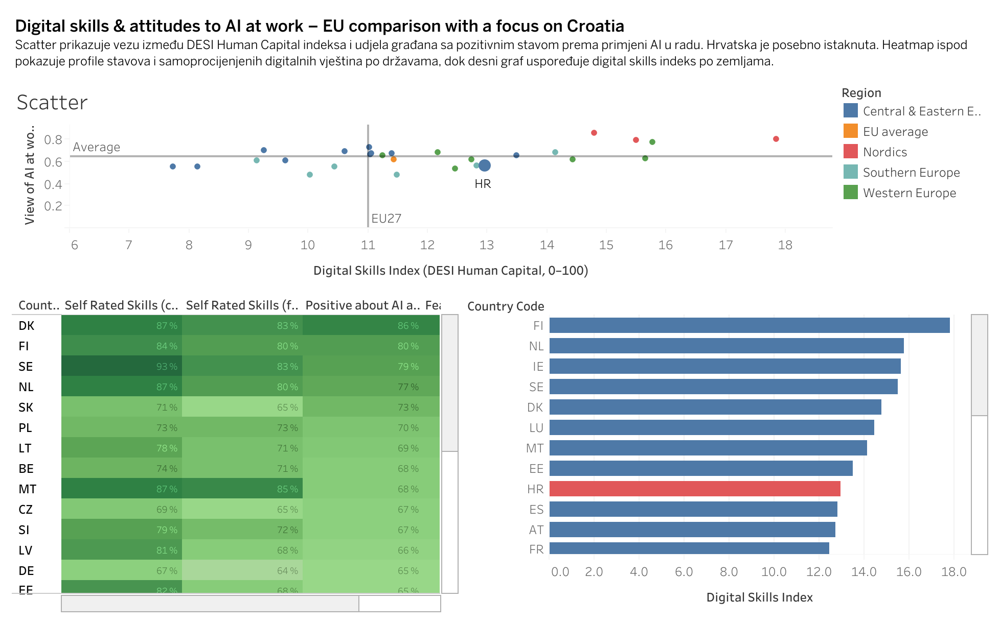

# EU AI & Digital Skills Dashboard (Croatia focus)

A Tableau project that combines Eurobarometer data on attitudes towards artificial intelligence and the DESI/Digital Decade index of digital skills.

## Live dashboard (Tableau Public)
- **View the dashboard:** https://public.tableau.com/views/EUAIDigitalSkillsCroatiafocus/Dashboard1

- ## Preview

## Goal

Make it easy to:
- get a quick, high-level view of readiness/digital skills indicators,
- compare Croatia against relevant benchmarks,
- support decision-making with a clear, visual summary (instead of scanning tables).

## Data

- **Eurobarometer SP554 – Artificial Intelligence and the Future of Work (Volume A)** 
- Extracted indicators: positive attitude towards AI in the workplace, fear of job loss, self-assessment of digital skills for current and future work.
- **DESI / Digital Decade – Human Capital (Digital Skills Index)** 
- Digital skills index (human capital, weighted score 0–100) for 2022.

> Note: I’m sharing the dashboard output publicly; the exact dataset/source is referenced here for transparency and reproducibility.

## Approach (what I did)

1) **Problem framing**
   - Defined the core question: “How does Croatia compare on key AI/digital readiness & skills indicators, and what are the most relevant gaps/strengths?”

2) **Data preparation**
   - Cleaned and standardised the dataset (consistent naming, data types, missing values).
   - Ensured indicators were comparable across entities/time (where applicable).
   - Created a tidy structure suitable for dashboarding (dimensions vs. measures).

3) **Dashboard design (Tableau)**
   - Selected a small set of visuals that answer the main questions quickly (comparison + trend/structure views).
   - Prioritised readability: clear labels, consistent scales, and an “at-a-glance” layout.
   - Added interactivity (filters/highlighting) so users can explore without losing context.

4) **Quality checks**
   - Sanity-checked values after transformations (spot checks + consistency checks).
   - Validated that interactions (filters, selections) behave as expected.

## What to look at (how to review)

- Start with the overall Croatia-focused view.
- Use filters/interactions to compare benchmarks (e.g., different groups/years/indicators — depending on the dashboard controls).
- Focus on the “so-what”: which indicators are strongest/weakest and where the biggest gaps appear.

## Key takeaways (from the dashboard)
- Croatia’s **Digital Skills Index is ~13.1**, above the EU27 reference line (~11), indicating **stronger-than-average digital skills** in this view.
- Croatia’s **attitude toward AI at work (~0.55)** is **slightly below the indicated average (~0.6)**, suggesting skills are relatively strong while workplace AI sentiment is more cautious.
- The scatter suggests a **generally positive relationship** between digital skills and AI attitudes, but not a one-to-one match—countries with similar skills can differ in AI sentiment.
- In the ranking view, Croatia sits in the **mid-to-upper group**: below top performers (e.g., FI/NL/IE/SE) but ahead of several others (e.g., ES/AT/FR), supporting a “solid foundation with room to grow” narrative.

## Visuals

- **Scatter plot**: Digital Skills Index (X) vs. positive attitude towards AI at work (Y), colors = EU regions, Croatia highlighted, EU27 reference line.
- **AI heatmap**: profiles of attitudes and self-assessed digital skills by country.
- **Bar chart**: ranking of countries according to the Digital Skills Index, with Croatia highlighted.
