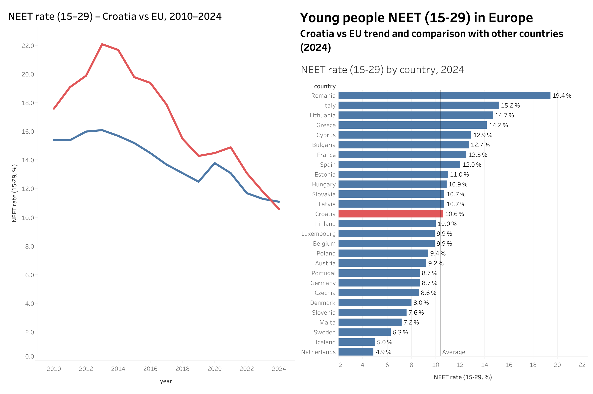

# Young people NEET (15–29) in Europe – Croatia vs EU

## Project overview
In this project I analyse the share of young people (15–29) who are neither in employment nor in education or training (NEET) across European countries. The focus is on Croatia compared to the EU-27 average and to other European countries.

## Live dashboard (Tableau Public)
- **View the dashboard:** https://public.tableau.com/views/YouthNEETrate15-29inEurope-CroatiavsEU/Dashboard1

- ## Preview

## Questions
- How has the NEET rate for young people evolved in Croatia compared to the EU-27 over time?
- Which countries have the highest NEET rates in the latest available year?
- Where does Croatia stand relative to other countries and to the EU average?

## Goal
Make it easy to:
- compare Croatia to the EU benchmark at a glance,
- identify which countries sit at the top/bottom of the ranking (depending on the view),
- understand how the indicator changes over time.
  

## Data
- Source: Eurostat, **edat_lfse_20 – Young people neither in employment nor in education and training (NEET)**  
- Filters:
  - Age: 15–29  
  - Sex: Total  
  - Unit: Percentage of population  
  - Geography: EU-27 and selected European countries  
  - Years: 2010–2024 (depending on availability)

## Approach (what I did)
1) **Problem framing**
   - Defined the core questions: “How does Croatia compare to the EU benchmark?” and “How does the NEET rate vary across countries and over time?”

2) **Data preparation**
   - Cleaned and standardised the dataset (country naming, data types, missing values).
   - Filtered the data to the relevant age group (15–29) and geography scope (Europe/EU + Croatia focus).
   - Created a tidy structure for Tableau (dimensions vs. measures), enabling consistent filtering and comparison.

3) **Dashboard design (Tableau)**
   - Built a layout that supports quick benchmarking (Croatia vs EU) and broader context (cross-country comparison / trends).
   - Prioritised clarity: readable labels, consistent scales where relevant, and an intuitive flow from “overview” to “details”.
   - Added interactivity (filters/highlighting) so users can explore countries/years without losing the benchmark context.

4) **Quality checks**
   - Spot-checked values after transformations to ensure consistency.
   - Verified that filters and interactions behave as expected for the Croatia vs EU comparison.

## Key takeaways (from the dashboard)
- In **2024**, Croatia’s NEET rate (15–29) is **10.6%**, slightly above the displayed average (**10.0%**, +0.6 pp).
- Croatia peaked around **2013–2014 (~22%)**, followed by a sustained decline to **~10–11% by 2024** (roughly an ~11 pp improvement from the peak).
- Over time, Croatia **converges toward the EU trend**, with the gap narrowing substantially in the later years of the series.
- Cross-country variation in **2024** is large (e.g., **Romania: 19.4%** vs **Netherlands: 4.9%**), highlighting substantial differences across countries.
- Croatia sits in the **middle of the 2024 distribution**, making “peer benchmarking” against countries in the ~9–12% range a practical next step.

 
## Tools
- Tableau (visualisation)
- Excel (light data cleaning and export from Eurostat)

## How to review (recommended)
1. Start with the **Croatia vs EU** comparison to get the benchmark view.
2. Use the dashboard interactions to explore:
   - country differences (ranking or distribution views),
   - changes over time (trend views),
   - any notable outliers.
3. Focus on the “so-what”: where Croatia stands relative to the benchmark and whether the gap is widening or narrowing.
   
