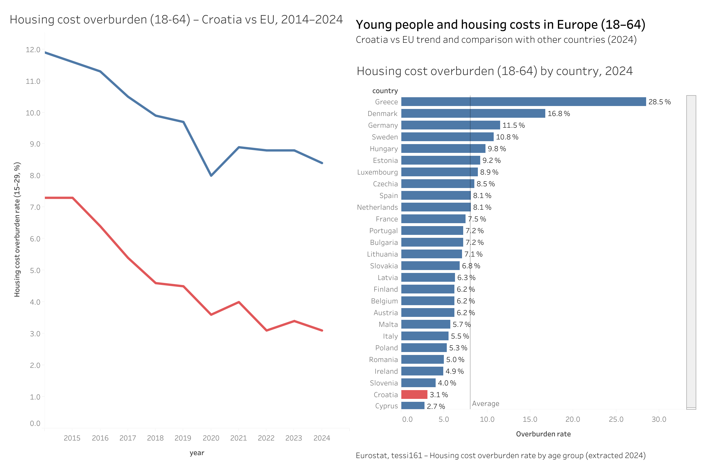

# Young people and housing cost overburden (18-64) in Europe – Croatia vs EU

## Project overview
In this project I analyse the housing cost overburden rate for young people (18-64) across European countries. The focus is on Croatia compared to the EU-27 average and to other EU member states.

## Preview
- Live Tableau preview: https://public.tableau.com/views/Youngpeopleandhousingcosts1529inEuropeCroatiavsEU/Dashboard1?:language=en-GB&:sid=&:redirect=auth&:display_count=n&:origin=viz_share_link

- Preview

## Questions
- How has the housing cost overburden rate for young people changed in Croatia over time compared to the EU-27?
- Which countries have the highest and lowest overburden rates in the latest available year?
- Where does Croatia stand relative to the EU average?

## Goal
Make it easy to:
- understand how housing cost pressure evolves over time (Croatia vs EU),
- benchmark Croatia against other European countries in 2024,
- highlight whether Croatia is an outlier (high or low burden) relative to peers.

## Data
- Source: Eurostat, **tessi161 – Housing cost overburden rate by age group**  
- Filters:
  - Age group: 18–64  
  - Sex: Total  
  - Unit: Percentage of population  
  - Geography: EU-27 and EU member states  
  - Years: 2013–2024 (depending on availability)

## Approach (what I did)
1) **Problem framing**
   - Defined the core questions: “How does Croatia compare to the EU over time?” and “Where does Croatia sit in the 2024 distribution across countries?”

2) **Data preparation**
   - Filtered to the relevant population group **(18–64)** and selected the housing overburden indicator.
   - Ensured consistent time coverage for trend comparison (2014–2024).
   - Prepared a tidy table structure suitable for dashboarding (countries/years as dimensions, rate as the measure).

3) **Dashboard design**
   - Built a two-part view:
     - **Trend**: Croatia vs EU over time (quick direction and convergence check)
     - **2024 ranking**: cross-country comparison to contextualise Croatia’s level
   - Prioritised readability: clean axes, labelled bars, and a reference “Average” marker for quick interpretation.

4) **Quality checks**
   - Spot-checked values after filtering and ensured the 2024 ranking view aligns with the trend endpoint.
   - Verified the “Average” reference line and ordering logic behave as expected.

## Key takeaways (from the dashboard)
- In **2024**, Croatia’s housing cost overburden rate (18–64) is **3.1%**, among the lowest in Europe—**second lowest after Cyprus (2.7%)**.
- Croatia is **far below the displayed average (~8%)**, a gap of roughly **~5 pp**.
- The Croatia trend improves from **~7.3% (2014)** to **3.1% (2024)** (about **-4.2 pp**), indicating a sustained long-term decline.
- The EU trend also declines (roughly **~12% to ~8.4%** over the period), but remains consistently higher than Croatia throughout.
- Cross-country differences in **2024** are extreme (e.g., **Greece: 28.5%** as a clear outlier), underscoring that housing cost pressure varies drastically by country.

## How to review (recommended)
1. Start with the **Croatia vs EU trend** to understand direction and long-term movement.
2. Switch to the **2024 ranking** to see where Croatia sits relative to the full country distribution.
3. Use the “Average” reference marker as a quick benchmark, then look at outliers (e.g., very high-burden countries) for context.

## Tools
- Tableau (visualisation)
- Excel (light data cleaning and export from Eurostat)
